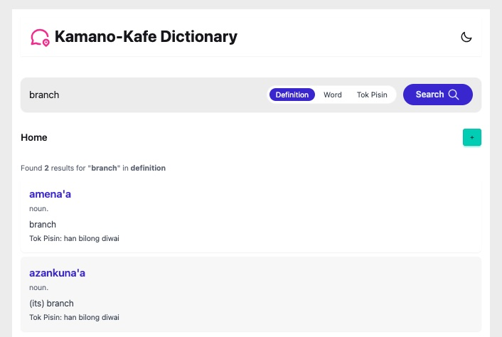

# 🌍 Kamano-Kafe MCP Dictionary App

A microservice-powered dictionary and translation interface for the Kamano-Kafe language of Papua New Guinea. Built with FastAPI, Jinja2, and TailwindCSS, this app allows users to view, create, update, and delete dictionary entries from a structured JSON-based store.

---

## 🧰 Tech Stack

- **Backend Framework**: FastAPI (Python 3.8+)
- **Templating Engine**: Jinja2
- **Styling**: Tailwind CSS + DaisyUI
- **Frontend Behavior**: HTMX (planned)
- **Storage**: JSON file (currently `a_complete.json`)
- **Packaging**: pip + virtualenv
- **Live API Docs**: Swagger (`/docs`) and ReDoc (`/redoc`)

---

## 🚀 Key Features

- ✅ View all dictionary entries from a given letter (currently A–a)
- ✅ Add new words with part of speech, Tok Pisin, and examples
- ✅ Edit and update existing entries
- ✅ Delete words from the dictionary
- ✅ View detailed Kamano-Kafe + English example sentences
- ✅ REST API and Web UI with shared data
- 🔜 Full multi-letter support (Bb–Zz)
- 🔜 Search functionality
- 🔜 HTMX-powered inline editing

---

## 🏗️ Build Process

1. **Define JSON structure** for Kamano-Kafe entries
2. **Extract data** from PDF using `pdfplumber` and convert to `a_complete.json`
3. **Scaffold FastAPI backend** with CRUD API routes
4. **Add templated views** using Jinja2 and TailwindCSS
5. **Wire up TailwindCSS and DaisyUI** with minimal styling
6. **Enable dynamic form handling** with POST, PUT, DELETE
7. **Plan frontend enhancements** with HTMX and JavaScript

---

## 🎓 Lessons Learned

- Working with dictionaries in non-standardized formats (PDF, semi-structured text) requires careful parsing.
- FastAPI is excellent for combining RESTful APIs and templated web views.
- Tailwind + DaisyUI significantly accelerate frontend design without heavy JS frameworks.
- File-based storage works well for prototypes but will require a switch to a DB (e.g., SQLite, MongoDB) for scaling.

---

## 🧠 Areas for Improvement

- [ ] Support loading entries from **Bb to Zz** dynamically
- [ ] Add **search and filtering** (e.g., by Tok Pisin, part of speech)
- [ ] Improve **error handling and validation** in forms
- [ ] Replace JSON with **database or NoSQL storage** for large datasets
- [ ] Enable **HTMX-based inline updates** without page reloads
- [ ] Add **auth/admin controls** for editing entries
- [ ] Dockerize for consistent deployment

---

## 🛠️ Setup Instructions

### 1. Clone the Repository

```bash
git clone https://github.com/glenhayoge/kamano-mcp.git
cd kamano-mcp
```
### 2. Create a Virtual Environment

```bash
python -m venv venv
source venv/bin/activate  # or venv\Scripts\activate on Windows # or venv\Scripts\activate on Windows
```

### 3. Install Requirements

```bash
pip install -r requirements.txt
```
 Compile Tailwind CSS

### 4. Compile Tailwind CSS

```bash
npm install -D tailwindcss daisyui
npx tailwindcss -i ./app/static/css/styles.css -o ./app/static/css/output.css --watch

```
### 5. Run the App

```bash
uvicorn app.main:app --reload
```

Open your browser:

Web UI: http://localhost:8000

API Docs: http://localhost:8000/docs


## 📽️ Demo Video/GIF



A quick walkthrough to be posted here soon

## 📝 License & Acknowledgments

- © 2025 [Glen Hayoge](https://glensea.com) - [Dzagoo Digital Technologies](https://dzagoo.com)

- Language data extracted from Kamano-Kafe Dictionary by SIL PNG

- Built with ❤️ for language preservation in Papua New Guinea
